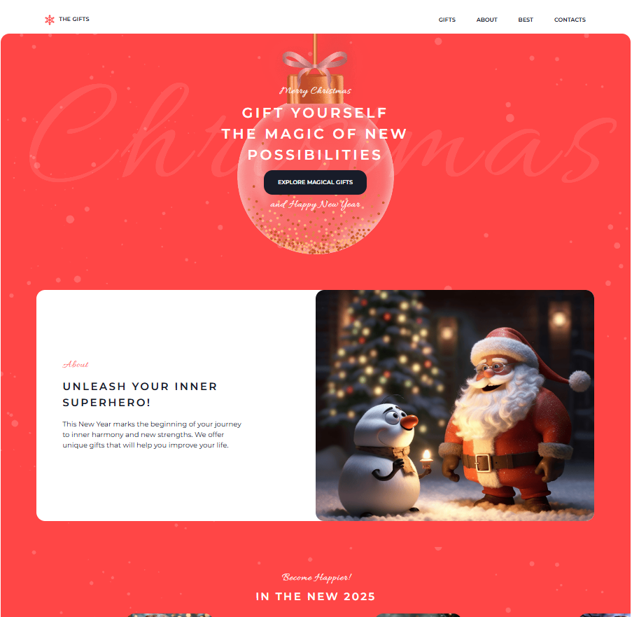
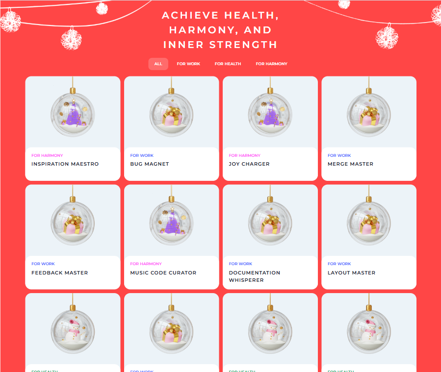

# Christmas Shop

[Link to the app](https://kat2709.github.io/christmas-shop)

## Project's Description

Christmas holidays are just around the corner! It's time to shop for gifts... but where?  
Christmas Shop is a project where you will need to create a website consisting of two pages, make it responsive, and add interactivity.  
It's time to create a cozy place for buying interesting gifts!

[Link to the Figma](https://www.figma.com/design/zTB01BwWZVoXYK5atH3eZT/Christmas-Shop?node-id=0-1&node-type=canvas&t=GWFQsdba2FRZidYv-0)

## Key skills

- Valid semantic responsive web design;
- Easy-to-maintain readable code;
- Exporting styles and graphics from Figma;
- Using JavaScript to implement the functionality specified in the task.

## Screenshots

